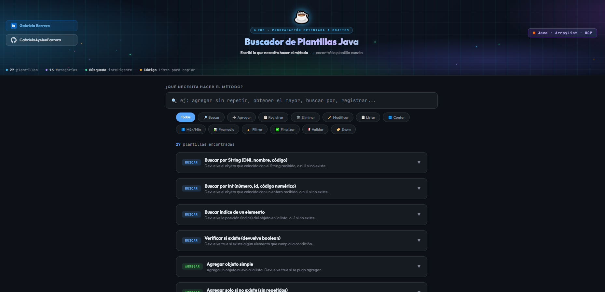

# ☕ Buscador de Plantillas de Métodos Java

Una herramienta web creada para ayudar a estudiantes de programación a encontrar rápidamente plantillas de métodos en Java para practicar y preparar parciales.

---

## 👉 Probar la app online

https://gabrielaayelenbarrera.github.io/java-method-templates/

---

## 🚀 Preview


---
## 💡 ¿Por qué hice este proyecto?

Mientras curso la carrera de Analista de Sistemas noté algo muy común:

Sabemos la lógica… pero al momento de escribir el método desde cero nos quedamos en blanco.

Este proyecto nace para resolver eso.

La idea es tener un **buscador rápido de soluciones típicas** que aparecen en parciales y ejercicios de Programación Orientada a Objetos.

---

## 🔎 ¿Qué permite hacer?

Podés escribir qué necesitás hacer y la app te muestra:

- 🧠 Pasos lógicos del algoritmo  
- 💻 Código Java listo para copiar  
- 🎯 Métodos típicos de parciales 

---
## Ejemplos incluidos:

- Buscar elementos en ArrayList

- Validaciones (DNI, rangos, strings)

- Métodos MAX / MIN

- Recorridos con while

- Promedios y contadores

- Métodos con Enum

- Alta / baja / modificación

- Listados filtrados

---
## 🛠️ Tecnologías utilizadas

### 🌐 Frontend
- 🧱 HTML  
- 🎨 CSS  
- ⚡ JavaScript  

### ☕ Contenido
- Plantillas y lógica en **Java**

---

## 🎯 Objetivo del proyecto


- Ayudar a estudiantes que están aprendiendo:


- Programación Orientada a Objetos


- Lógica de programación


- Métodos típicos de ejercicios


- Uso de ArrayList


- Validaciones de datos

---
## 📂 Estructura del proyecto
java-method-templates
```bash
│
├── index.html
├── css/
│   └── styles.css
└── js/
    └── script.js
```

💼 LinkedIn:


https://www.linkedin.com/in/gabrielabarrera-/

🐙 GitHub:


https://github.com/GabrielaAyelenBarrera

## 👩‍💻 Autora

**Gabriela Ayelén Barrera**  
Estudiante de Analista de Sistemas – ORT Argentina
